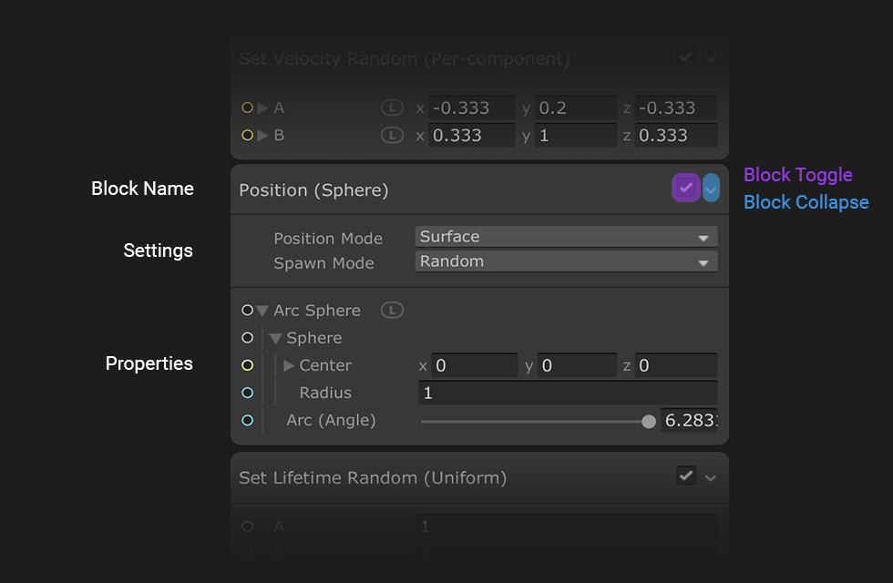

<b>Draft:</b> The content on this page is complete, but it has not been reviewed yet.

# Blocks

Blocks are Nodes that define the behavior of a [Context](Contexts.md). They are placed by the user and can be reordered in a Context Block Area. During the execution of the Effect Behavior they are executed from top to bottom.

Blocks can be used for many purposes, from simple value storage (for example, random Color) to high-level complex operations such as Noise Turbulence, Forces or Collisions.

## Adding Blocks

You can add Blocks to a context by:

* Right Clicking the context and selecting "Create Block" from the context menu.
* Pressing the spacebar with the cursor hovering  a context.

> Tip: The block newly created will be placed at the closest position of the cursor. Use this to place blocks directly at the correct position.

## Manipulating Blocks

Blocks are nodes that you can manipulate in a bit different way than regular nodes. They are stacked into a container and their workflow logic connect vertically without visible links.

* You can reorder Blocks by Dragging their header using the mouse...
  * ...among the same Context container.
  * ... to another compatible Context.
* You can cut, copy, paste, and duplicate blocks
  * Using the Right-click context menu
  * Using the following Keyboard Shortcuts:
    * Ctrl + X : Cut
    * Ctrl + C : Copy
    * Ctrl + D : Duplicate
    * Ctrl + V : Paste

* You can Disable a block by unticking its enabled checkbox located in the top-right corner.
  * Disabling a block will disable it totally and will remove it from the compilation.
  * Toggling block will require a recompilation of the graph.

## Configuring Blocks

Adjusting Block [Settings](GraphLogicAndPhilosophy.md#settings) in the Node UI or the Inspector can change the way the Block looks and behaves. 

> For instance, Changing the Composition Setting (in inspector) of a `Set Velocity` block, from Overwrite to Blend, will change the node title to `Blend Velocity` , and will add a Blend property to the Node UI as well.

