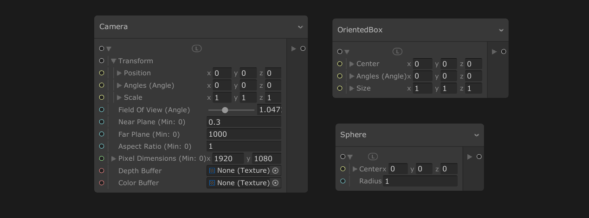

<b>Draft:</b> This page has its content written, but its formatting has not been reviewed at the moment.

# Properties

Properties are editable fields that you can connect to graph elements using [Property workflow](GraphLogicAndPhilosophy.md). They can be found on Graph Elements such as  [Contexts](Contexts.md),  [Blocks](Blocks.md) and [Operators](Operators.md).

## Using Properties

Properties are displayed on graph elements and will change their value accordingly to their actual value in the graph : Connecting another property to a property slot will display the computed value of the connected property.

> Note: After disconnecting a connected property, the field will revert to the previously set property value.

## Property Types

Properties in Visual Effect Graph can be of any type defined by the user, from base data types such as boolean, integer, float, Vectors, Textures, AnimationCurve or Gradient. 

### Accessing Property Components

Properties that are made of multiple components (such as Vectors, or Colors) can display every component individually in order to connect these to other properties of compatible type : to do so, use the arrow next to the property to unfold the components.

### Casting Properties

Properties can connect between base types to perform cast. Casts are useful in order to change the data type you are working on in order to inherit its specificites : for instance casting a float to integer to benefit from integer division.

Casting from one type to another abides with the following rules:

* All Casting rules from HLSL apply:
  * Except Boolean types that cannot be cast
  * Scalars will cast into vectors by setting all compoents
* Vectors will cast into vectors of lesser size by taking only the first N components

### Compound Property Types

Compount Property Types are made from base data types in order to describe more complex data structures. For instance, a Sphere is composed of a Position (Vector3) and a radius (float).

Compound property types can be expanded in order to access their components. 

### Spaceable Properties

Spaceable properties are specific Property Types that carry a **Space information** (Local/World) along with its value. This information is used by the graph to perform automatic space transformations when required.

The Space Modifier is visible left to the Property Field and can be changed by clicking on it.

For Example : Position type carries a Vector3 value and a Space : setting a the property to Local [0,1,0] will tell the graph that we refer to the 0,1,0 value in local space.

Depending on the [System Simulation Space](Systems.md#system-spaces), the value will be automatically transformed to the simulation space if required.

> Tip: Manually changing a Property Space can be achieved using the Change Space operator

## Property Nodes

Property Nodes are special  [Operators](Operators.md) nodes that enable accessing Graph-Wide Properties defined in the [Blackboard](Blackboard.md). Using these properties enable you reuse the same value throughout the graph at different places.

* Property Nodes display a Green dot left to the Property name if the property is exposed.
* You can create a Property Node :
  * By Dragging the Node from the Blackboard Panel into the Workspace.
  * By using the Create Node menu from the Right Click context menu and selecting the desired property from the Property category.
* You can convert a Property Node to an Inline node of the same type by right-clicking the property node and selecting "Convert to Inline" 
* Deleting a property from the blackboard will also delete all its property node instances from the graph.