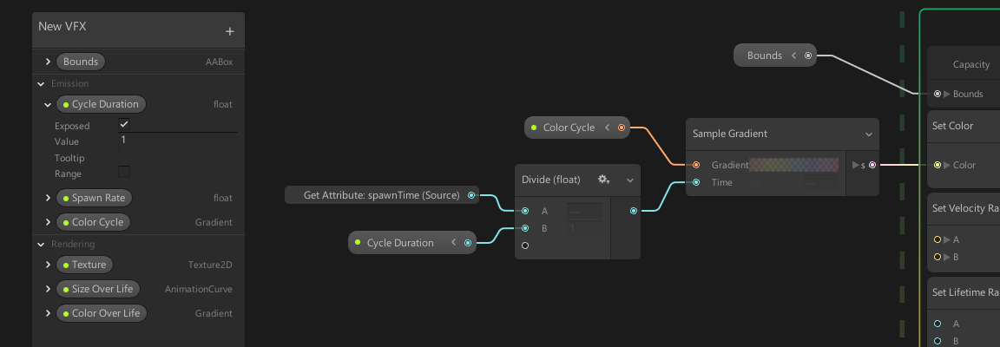
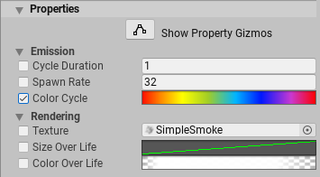

# Properties and Blackboard

Properties are global variables that can be shared throughout the graph in order to factorize usage of the same values. For example a bounding box property can be set once and used for many particle systems. Properties can be defined, ordered and categorized in a blackboard window.

You can use properties as **local constants** or **exposed**. Exposed properties are visible on the [Visual Effect Component](VisualEffectComponent.md) and can be accessed via the C# API. 

Exposed Properties display a green dot left to their label while local constants do not display this dot.

## Properties in Blackboard

You can open the Blackboard panel using the **Blackboard** button located in the right side of the Visual Effect Graph window's toolbar.

### How to Create Properties

You can create properties by clicking the + button located in the top-right corner of the blackboard, then select a property type in the menu.

You can also convert an inline operator to a property by right-clicking the node and selecting either:

- Convert to Property if you want to create a local variable
- Convert to Exposed Property if you want to create an exposed property

> Regardless of the option you choose, you can edit the Exposed flag at a later time.

### How to Edit Properties

Properties can be edited in the blackboard by clicking the folding arrow left to them. It expands the following property options:

* Exposed : Whether the property is exposed and visible to the Visual Effect Inspector.
* Value : The default Property value.
* Tooltip : A tooltip string that appears when hovering the property in the Visual Effect Inspector.

> Some property types display additional options, for instance a Range option for float properties.

### How to Arrange Properties

- You can **rename** a property by right-clicking it, then select rename from the context menu. You can also start renaming by double clicking the property name. You can then type the name in the editable field and validate by pressing enter or clicking somewhere else.
- You can **drag and drop** properties in the blackboard panel to reorder them.
- You can **delete** a property by right-clicking it, then select delete from the context menu, or select the property and use the **Delete** key.

### Property Categories

Categories enable sorting properties in groups, so they appear in a more tidy way:

- You can **create** a category by clicking the + button located in the top-right corner of the blackboard, then select **Category**.
- You can **rename** a category by right-clicking its title, then select rename from the context menu. You can also start renaming by double clicking the category title. You can then type the name in the editable field and validate by pressing enter or clicking somewhere else.
- You can **delete** a category by right-clicking its title, then select delete from the context menu, or select the category and use the **Delete** key. Deleting a category will also delete all the properties contained in it.
- You can drag and drop a category to **reorder** them by dragging its header.
- You can **drag and drop properties** from a category to another, or at the top of the window if you want this property to be not part of a category.

## Property Nodes

Property nodes have a slightly different visual than standard nodes : They display the Property Name and an optional green dot if the property is exposed.

## Exposed Properties

Exposed properties become visible on a [Visual Effect Inspector](VisualEffectComponent.md), in the Properties area, if their Exposed flag is checked in the blackboard. They appear in the same order and categories as they are defined in the blackboard.

### Overriding Property Values

You can override a property value from its default by ticking the checkbox in the left part of the inspector. 

- Once overridden, the value can be changed for this instance. 
- You can revert back to the default value by toggling off the override checkbox.

### Editing Properties using Gizmos

Some advanced property types can be edited using gizmos. In order to enable Gizmo editing, click the **Show Property Gizmos** button to enable advanced editing, then click the Edit button next to every compatible property in order to use its editing gizmo.

