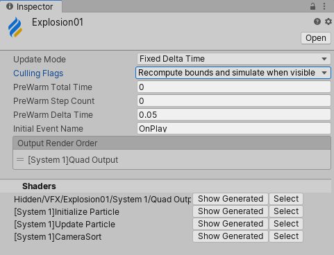

<b>Draft:</b> The content on this page is complete, but it has not been reviewed yet.

# Visual Effect Graph Assets

Visual Effect Graph Assets are the data containers of Visual Effect Graph. They contain all the user-authored data required to play a Visual Effect Graph:

* Graph Elements
* Exposed Properties
* Compiled Shaders
* Operator Bytecode

## Creating Visual Effect Assets

Visual Effect Graph Assets can be created Using the **Assets > Create > Visual Effect** Menu, by selecting **Visual Effect Graph**.

The asset will be created in the current folder of your Project Window.

## Editing Visual Effect Assets

Visual Effect Graph Assets can be opened in the [Visual Effect Graph Window](VisualEffectGraphWindow.md)  :

* By Selecting the asset in the Project View, and clicking the **Open** button in the Inspector's header.
* By Double-Clicking the asset
* By Clicking the Edit Button next to the **Asset Template** field in the  [Visual Effect Inspector](VisualEffectComponent.md#the-visual-effect-inspector) 

#### Visual Effect Asset Inspector

When Selected, a Visual Effect Graph Asset displays its inspector for Asset-Wide configuration Options.

| Property Name       | Description / Values                                         |
| ------------------- | ------------------------------------------------------------ |
| Update Mode         | Sets at which rate Visual Effect Graph is updated: **- Fixed Delta Time: ** Updates at the rate defined in the [Visual Effect  Project Settings](VisualEffectProjectSettings.md) **- Delta Time: ** Updates at the same rate as the rendering. |
| Culling Flags       | Sets whether the visual effect will be updated depending on its culling state (bounding box being visible by at least one camera): **- Recompute bounds and simulate when visible:** The effect will only update, even its bounding box if it is visible. When using dynamic bounding box (computed with operators), you may want to change this setting to one of the two options with **Always Recompute Bounds** .  **- Always Recompute Bounds, simulate when Visible: ** the system will only recompute bounds regardless of the culling, and will perform update of the graph based on the updated bounds. **- Always Recompute Bounds and Simulate: ** The whole effect will be simulated all the time, regardless of its bounds. |
| PreWarm Total Time  | Duration the effect should be simulated when `Reset()` is performed. |
| PreWarm Step Count  | How many simulation Steps shall be used to compute PreWarm. More steps increase precision at the expense of performance. |
| PreWarm Delta Time  | Delta Time used for the PreWarm Mechanism (based on Total Time and Step Count), adjust this value and step count if you need precise delta time for your simulation. |
| Initial Event Name  | Name of the Event Sent when the Effect becomes Enabled. Defaults to OnPlay but can be changed to another Event Name, or blank field to keep all systems not spawning by default. |
| Output Render Order | Reorderable List where all Output Contexts are displayed in their rendering order (First items before/behind other items) |
| Shaders             | A list of all shaders compiled for the graph, available as read-only for Debugging purposes. Using the Shader Externalization in [Visual Effect Preferences](VisualEffectPreferences.md) can externalize shaders temporarily for debugging purposes. |

