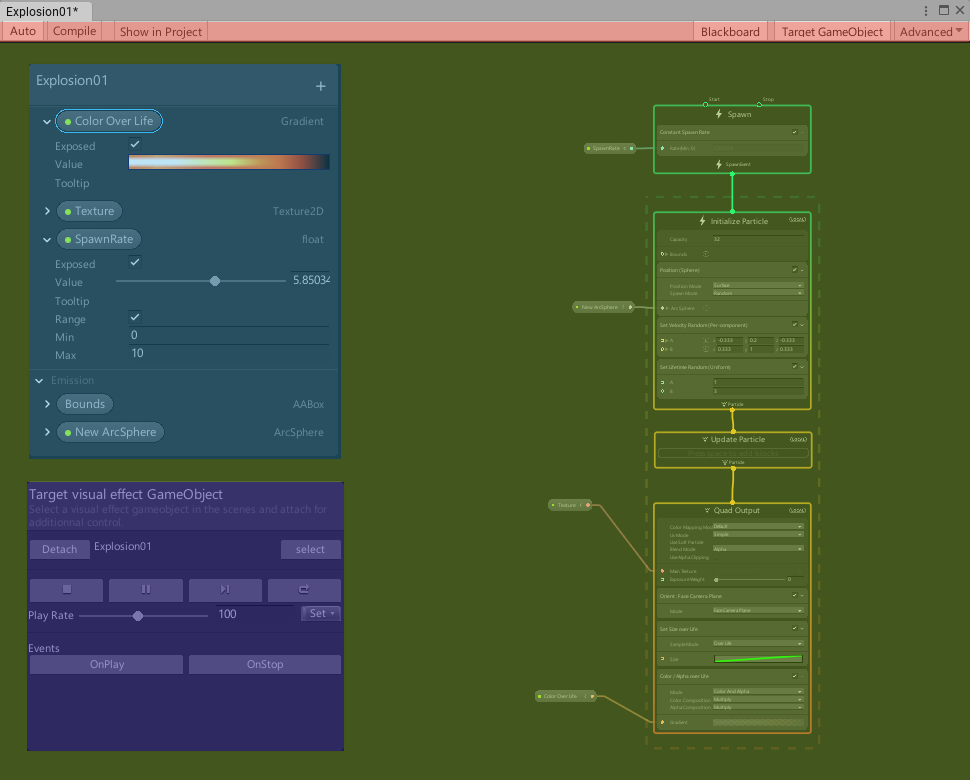

<b>Draft:</b> The content on this page is complete, but it has not been reviewed yet.

# The Visual Effect Graph Window

The Visual Effect Graph Window is the main window of Visual Effect Graph, where users edit Visual Effect Graph assets, and subgraphs.  The window displays the workspace of systems, contexts and operators contained in a  [Visual Effect Graph Asset](VisualEffectGraphAsset.md). 

## Opening the Visual Effect Graph Window

You can open the Visual Effect Graph Window using various methods:

* By Double-Clicking a  [Visual Effect Graph](VisualEffectGraphAsset.md) , or [SubGraph](VisualEffectGraphSubgraphAsset.md) Asset, or using the Open button in the Asset inspector.
* By clicking the Edit Button next to the Asset Template field in the [Visual Effect Inspector](VisualEffectComponent.md) (Doing so also connects the Target Visual Effect GameObject panel to this instance)
* From the Menu, by clicking Window / Visual Effects / Visual Effect Graph. Opening the window using this method will open an empty editor and require you to open an asset to start working on it.

 ## The Visual Effect Graph Window

The Visual Effect Graph Window is composed of many zones and elements:

- **Toolbar** (Red) : Contains controls that affect the graph globally, and display additional panels
- **Node Workspace** (Green) : This area is where the graph can be edited and navigated.
- **Blackboard** (Blue) : This panel displays properties of the graph.
- **Target Visual Effect GameObject** (Purple) : This panel displays controls to an attached Game Object.

### Toolbar

The Visual Effect Graph Window Toolbar contains functionality to operate on a Visual Effect Graph asset.

| Item              | Description                                                  |
| ----------------- | ------------------------------------------------------------ |
| Auto              | **Toggle** : Toggles Auto-compilation of the Graph           |
| Compile           | **Action** : Recompiles the Currently opened Graph           |
| Show in Project   | **Action** : Pings the Currently opened Graph's Asset in the Project View. |
| Blackboard        | **Toggle** : Toggles visibility ot the **Blackboard Panel**  |
| Target GameObject | **Toggle** : Toggles visibility of the **Target VisualEffect GameObject Panel** |
| Advanced          | **Menu:** Displays Advanced Properties   * **Runtime Mode (Forced)**: Forces optimized compilation, even with editor open.  * **Shader Validation (Forced)**: Performs a forced shader compilation upon effect recompile, even if no visual effect is visible, so the shader errors are displayed.   |

### Node Workspace

The node workspace is the whole area below the toolbar where the graph can be navigated and edited. The node workspace also hold the **Blackboard** and **Target VisualEffect GameObject** panels.

### Blackboard

The **Blackboard** is a toggleable panel that is displayed in the Node Workspace. It is a floating panel, independent to the zoom and position of the Workspace View, and it is always displayed on top of the graph.

This panel can be resized by dragging its bottom-right corner and dragged around using its header.

### Target Visual Effect GameObject

The **Target Visual Effect GameObjec**t panel is a draggable panel that is displayed in the Node Workspace. It is a floating panel, independent to the zoom and position of the Workspace View, and it is always displayed on top of the graph.

This panel can be resized by dragging its bottom-right corner and dragged around using its header.

## How to use the Node Workspace

### Navigating the Workspace

The workspace can be navigated using common controls, here is a recap of all actions used to navigate the graph:

#### Pan the graph around :

* Dragging Middle Mouse button
* Dragging Left Mouse button while holding **Alt** Key.

#### Zoom in and out using :

* Mouse Wheel

#### Select Elements:

* By clicking on them individually:
  * Add to/Remove from current selection by holding **Ctrl** key
* By making a selection rectangle 
  * Start dragging from a point in an empty space
  * Then release the click to select all elements in the rectangle
  * Add to/Remove from current selection by holding **Ctrl** key
* By making a selection marquee
  - Start dragging from a point in an empty space while holding **Shift** key
  - Then release the click to select all elements touched by the marquee.

#### Clear Selection:

* By clicking into an empty space

#### Focus on selected nodes

*  Press the F key (or on the full graph when nothing is selected)

#### Copy, Cut and Paste, and Duplicate elements:

* Right Click Context Menu items
* Keyboard Shortcuts:
  * Ctrl+C (Copy) 
  * Ctrl+X (Cut) 
  * Ctrl+V (Paste) 
  * Ctrl+D (Duplicate)

### Adding Graph Elements

You can add graph elements using various methods depending on what you need to do:

- **Right Click Menu** : Using the right click menu, select Add Node, then select the Node you want to add from the menu. This action is context-sensitive, based on the element that stands below your cursor and will provide you only with the graph elements that are compatible.
- **Spacebar Menu** : This shortcut is the equivalent of making a right-click, then selecting Add Node.
- **Interactive Connections** : While creating an edge from a port (either property or workflow), drag the edge around and release the click into an empty space to display the Node Menu. This action is context-sensitive and will provide you only the compatible graph elements that you can connect to.

### Manipulating Graph Elements

Graph Elements can be manipulated in the workspace :

#### Dragging Elements

- You can Drag Elements around using the left mouse button.
- You can Drag Blocks inside a Context or move them to another context using the left mouse button.

#### Resizing Elements

Some Elements, such as Sticky Notes, can be resized by dragging their outline or their corners.

